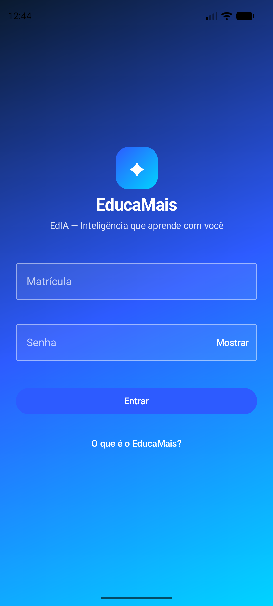
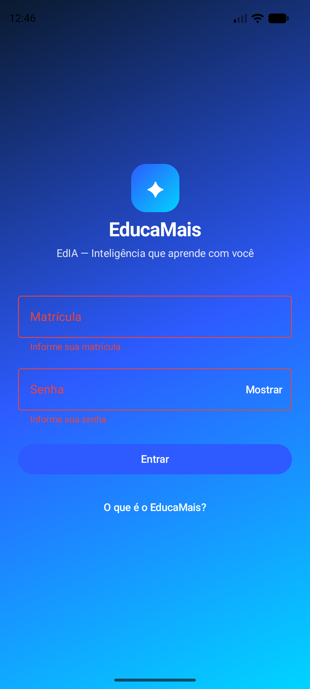
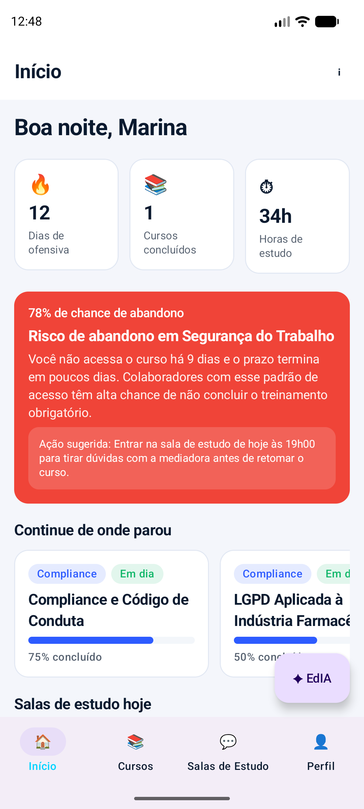
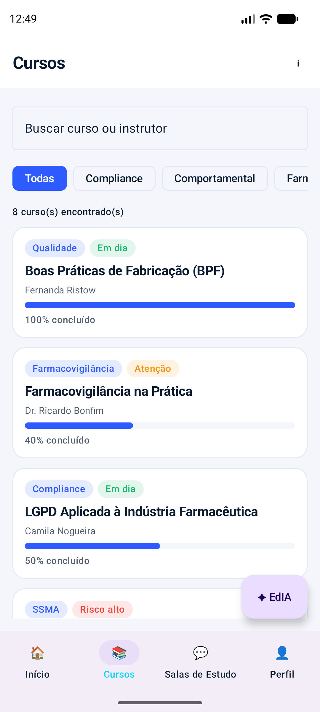
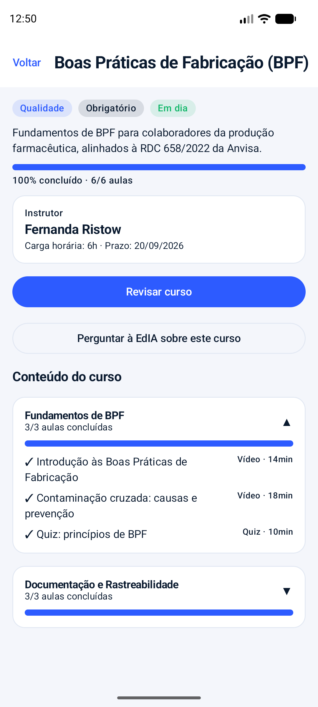
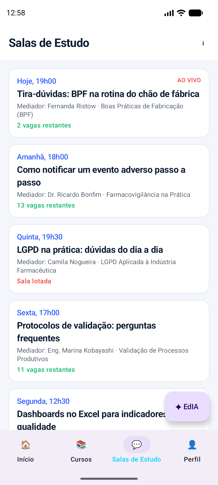
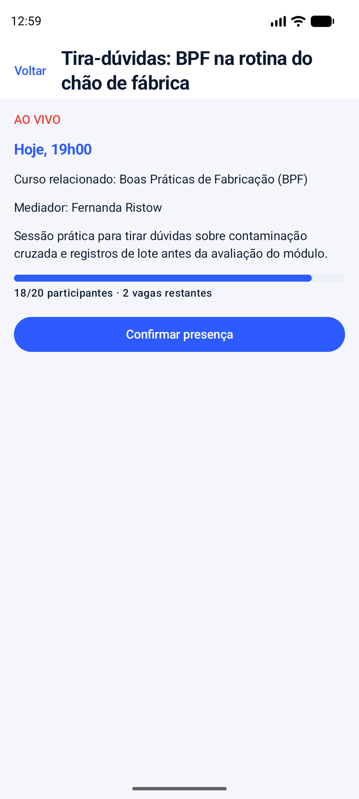
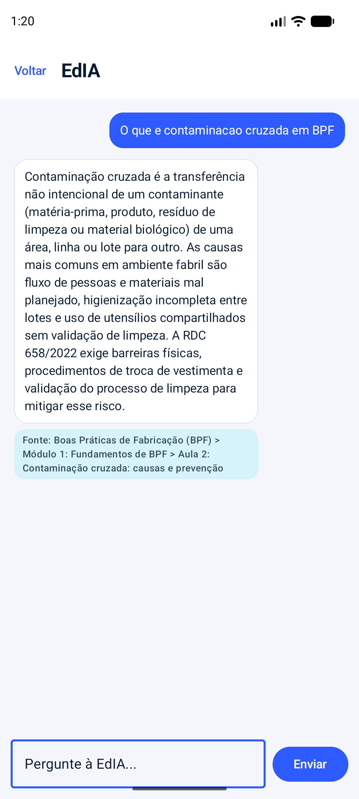
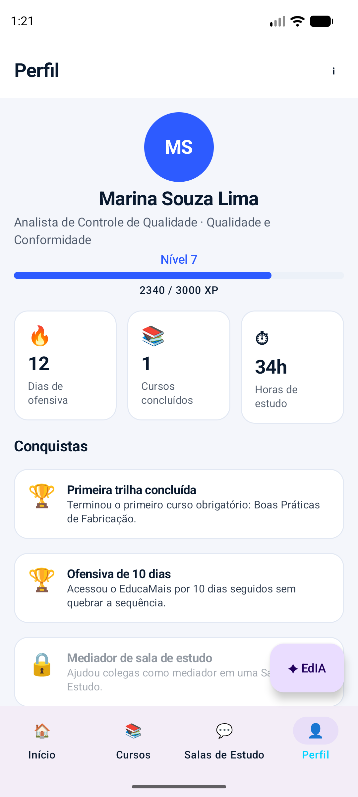
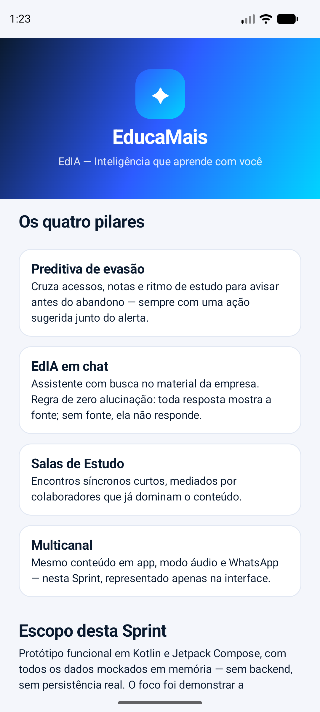

# EducaMais

**Nome do projeto:** EducaMais
**Nome da equipe:** EducaMais

App Android nativo do **EducaMais** — camada de inteligência sobre o Moodle
e o sistema legado de treinamentos de uma indústria farmacêutica, com o
assistente **EdIA**, *"Inteligência que aprende com você"*.

Trabalho da Sprint 3 da disciplina de Desenvolvimento Mobile.

## Integrantes

| Nome completo | RM |
|---|---|
| Samuel Okuma | 555370 |
| Juan Marini | 556678 |
| Eduardo Antunes | 555534 |
| Romeo Miranda | 557025 |
| Arthur Menon | 555918 |

## Repositório

<https://github.com/juan-marini/kotlin_2sem_sprint>

## Objetivo do aplicativo

O EducaMais não é um LMS: é uma **camada de inteligência por cima dos
sistemas de treinamento já existentes** na empresa (Moodle e sistema
legado), voltada a colaboradores de uma indústria farmacêutica que
precisam concluir treinamentos obrigatórios (BPF, Farmacovigilância,
LGPD, Validação de Processos, SSMA, Compliance).

O problema atacado é a **evasão e o baixo engajamento** nesses
treinamentos obrigatórios: o colaborador começa a trilha, perde o ritmo e
abandona, e a empresa só descobre quando o prazo regulatório já venceu.
A solução se organiza em quatro pilares:

1. **Preditiva de evasão** — cruza acessos, notas e ritmo de estudo e
   avisa antes do abandono, sempre com uma ação sugerida junto do alerta.
2. **EdIA em chat** — assistente com busca no material da empresa. Regra
   de zero alucinação: toda resposta mostra a fonte no material; sem
   fonte, ela não responde.
3. **Salas de Estudo** — encontros síncronos curtos, mediados por quem já
   domina o conteúdo.
4. **Multicanal** — mesmo conteúdo em app, modo áudio e WhatsApp (nesta
   Sprint, apenas representado na interface).

## Funcionalidades implementadas nesta Sprint

Requisitos funcionais priorizados para o MVP:

| # | Requisito funcional | O que foi implementado | Pilar do pitch |
|---|---|---|---|
| RF01 | Autenticação do colaborador | Login com matrícula e senha, validação local com mensagem de erro por campo, alternância de visibilidade da senha e indicador de carregamento | Acesso ao produto |
| RF02 | Painel de acompanhamento | Aba Início com saudação, indicadores (ofensiva, cursos concluídos, horas de estudo), cursos em andamento e salas do dia | Preditiva / engajamento |
| RF03 | Alerta preditivo de evasão | Cartão em destaque com probabilidade de abandono, motivo e **ação sugerida** | Preditiva de evasão |
| RF04 | Catálogo de treinamentos | Lista de cursos com busca por título/instrutor, filtro por categoria, contador de resultados e estado vazio | Base do produto |
| RF05 | Detalhe do treinamento | Progresso, instrutor, prazo, obrigatoriedade, nível de risco e módulos expansíveis com o status de cada aula | Base do produto |
| RF06 | Assistente EdIA com fonte | Chat que responde por palavra-chave e **sempre exibe a fonte** (`Curso > Módulo > Aula`); sem fonte, recusa responder | EdIA em chat |
| RF07 | Salas de Estudo | Listagem com indicação de ao vivo, ocupação e lotação, detalhe da sala e confirmação de presença com retorno visual | Salas de Estudo |
| RF08 | Perfil e gamificação | Avatar, nível, barra de XP, indicadores e conquistas (com bloqueadas esmaecidas) | Engajamento |
| RF09 | Representação multicanal | Bloco do Modo áudio na aba Início | Multicanal |

**Justificativa da priorização:** o pitch aponta a evasão em treinamentos
obrigatórios como o problema central, então priorizamos primeiro o que
demonstra o diferencial da solução — o **alerta preditivo com ação
sugerida** (RF03) e a **EdIA com citação de fonte** (RF06), que são os
dois pilares que distinguem o EducaMais de um LMS comum. Em seguida vieram
os fluxos de suporte sem os quais esses diferenciais não fazem sentido
(catálogo e detalhe de curso, RF04/RF05) e o pilar social de Salas de
Estudo (RF07). Gamificação (RF08) e multicanal (RF09) entraram por último,
representados na interface, por serem reforços de engajamento e não o
núcleo do problema.

## Tecnologias utilizadas

- **Kotlin** 2.2.10
- **Jetpack Compose** (Compose BOM 2026.02.01) — toda a interface, sem
  layouts XML
- **Material 3** — componentes, tema, tipografia e formas
- **Navigation Compose** 2.9.x/2.10.0 — navegação, rotas e parâmetros
- **Gerenciamento de estado** com `remember`, `mutableStateOf`,
  `rememberSaveable` e `mutableStateListOf` (sem injeção de dependência)
- **Corrotinas do Kotlin** — carregamento simulado do login e do chat
- **Gradle** 9.4.1 com **AGP** 9.2.1 e version catalog (`libs.versions.toml`)
- **Git/GitHub** para versionamento, com commits distribuídos ao longo do
  desenvolvimento

Sem API, Firebase, banco de dados local ou backend: todos os dados são
mockados em memória.

### Dependências relevantes

| Dependência | Versão |
|---|---|
| `androidx.navigation:navigation-compose` | 2.10.0 |
| `androidx.compose:compose-bom` | 2026.02.01 |
| `androidx.compose.material3:material3` | via BOM |
| `androidx.activity:activity-compose` | 1.13.0 |
| `androidx.core:core-ktx` | 1.19.0 |
| `androidx.lifecycle:lifecycle-runtime-ktx` | 2.10.0 |

## Como executar o projeto

**Ambiente utilizado no desenvolvimento:** Android Studio 2026.1.1
(build AI-261.23567.138.2611.15503007), JDK 21 (JBR embutido no
Android Studio), emulador Pixel 6.

1. Instale o [Android Studio](https://developer.android.com/studio)
   (versão 2026.1.1 ou compatível com AGP 9.2.1 / Kotlin 2.2.10) e o SDK
   do Android.
2. Clone o repositório:
   ```
   git clone https://github.com/juan-marini/kotlin_2sem_sprint.git
   ```
3. Abra a pasta clonada no Android Studio e aguarde o Gradle sincronizar.
   - O projeto usa `compileSdk 37`. Se essa plataforma não estiver
     instalada, o Gradle/Android Studio baixa automaticamente na primeira
     sincronização (é necessário aceitar a licença do SDK e ter conexão
     com a internet).
4. Crie ou selecione um emulador com **API 24 ou superior** (recomendado
   API 30+) no Device Manager.
5. Rode o app pelo botão ▶️ Run, ou via terminal:
   ```
   ./gradlew installDebug
   ```
6. Na tela de login, informe **qualquer matrícula** e uma **senha de pelo
   menos 4 caracteres** — a autenticação é mockada, não há validação de
   credenciais reais.

Não é necessária nenhuma chave de API, variável de ambiente ou
configuração adicional.

## Telas do aplicativo

Prints do app rodando no emulador Pixel 6 (arquivos em
[`docs/prints/`](docs/prints)).

### 1. Login

Tela de entrada com a marca do EducaMais sobre o gradiente da
identidade visual, campos de matrícula e senha, alternância de
visibilidade da senha e link para a tela Sobre.



### 2. Login — validação dos campos

Ao tentar entrar com os campos vazios, cada campo exibe a mensagem de
erro correspondente abaixo dele e o envio é bloqueado. O erro some assim
que o usuário volta a digitar.



### 3. Início — painel do colaborador

Saudação conforme o horário do dia, três indicadores (dias de ofensiva,
cursos concluídos, horas de estudo) e o **alerta preditivo de evasão** em
destaque, com a probabilidade de abandono, o motivo e a ação sugerida.
Abaixo, os cursos em andamento, as salas de hoje e o bloco do Modo áudio.



### 4. Cursos — catálogo com busca e filtro

Lista completa dos treinamentos, com campo de busca por título ou
instrutor, chips de filtro por categoria, contador de resultados e cartões
mostrando categoria, nível de risco, instrutor e progresso.



### 5. Detalhe do curso

Aberta ao tocar em um curso da lista (navegação com passagem de
parâmetro). Mostra categoria, obrigatoriedade e risco, descrição,
progresso, dados do instrutor, prazo, botão de continuar, botão para
perguntar à EdIA sobre aquele curso e os módulos expansíveis com o status,
o tipo e a duração de cada aula.



### 6. Salas de Estudo

Lista das salas com horário, mediador, curso relacionado e situação de
ocupação — incluindo a marcação **AO VIVO** e o estado **Sala lotada**.



### 7. Detalhe da sala de estudo

Informações completas da sala, barra de ocupação e botão de confirmar
presença. A confirmação é devolvida à tela anterior, que exibe um
Snackbar de retorno ao usuário.



### 8. EdIA — chat com citação da fonte

Conversa com a assistente: balões distintos por autor, chips de sugestão
antes da primeira pergunta e indicador de "consultando o material".
Toda resposta traz o bloco de **fonte** no formato
`Curso > Módulo > Aula` — é a regra de zero alucinação do produto.



### 9. Perfil

Avatar com as iniciais, nível e barra de XP, os três indicadores de
progresso e a lista de conquistas — as bloqueadas aparecem esmaecidas com
cadeado. Traz também o acesso à tela Sobre e o botão Sair.



### 10. Sobre o EducaMais

Cabeçalho com a marca sobre o gradiente, explicação dos quatro pilares do
produto e o escopo entregue nesta Sprint.



## Navegação entre telas

| Rota | Parâmetro | Tipo | Tela |
|---|---|---|---|
| `login` | — | — | Login |
| `home` | — | — | Home (casca com as 4 abas) |
| `curso/{cursoId}` | `cursoId` (path) | obrigatório | Detalhe do curso |
| `sala/{salaId}` | `salaId` (path) | obrigatório | Detalhe da sala de estudo |
| `edia?curso={curso}` | `curso` (query) | opcional | Chat da EdIA, com ou sem contexto de um curso |
| `sobre` | — | — | Sobre o EducaMais |

- **Passagem de parâmetro**: ao tocar em um curso ou sala da lista, o app
  navega para a tela de detalhe daquele item — `curso/{cursoId}` e
  `sala/{salaId}`, lidos com `navArgument` e `backStackEntry.arguments` em
  `EducaMaisNavHost.kt`.
- **Argumento opcional**: `edia?curso={curso}` — quando aberto pelo
  detalhe de um curso, a conversa já começa contextualizada.
- **Retorno de dados entre telas**: o detalhe da sala devolve a
  confirmação de presença para a Home via
  `previousBackStackEntry.savedStateHandle`, exibida como Snackbar.
- **Limpeza de pilha**: login → home e perfil → sair usam
  `popUpTo(...) { inclusive = true }`.
- Uma rota de detalhe aberta com id inexistente mostra um estado vazio
  com botão de voltar, em vez de quebrar o app.

## Dados mockados

Todos organizados no pacote `mock/`, um arquivo por entidade, sem nenhum
dado literal declarado dentro das telas e sem nenhuma chamada de rede:

- **8 cursos** (`CursosMock.kt`) do contexto farmacêutico — Boas Práticas
  de Fabricação, Farmacovigilância na Prática, LGPD Aplicada à Indústria
  Farmacêutica, Segurança do Trabalho em Ambiente Fabril, Validação de
  Processos Produtivos, Comunicação Assertiva com Times, Compliance e
  Código de Conduta, Excel Avançado para Análise de Dados — cada um com
  módulos e aulas de títulos plausíveis, carga horária, prazo e progresso
  variado (um concluído, um não iniciado, um em risco alto). O mesmo
  arquivo expõe `filtrarCursos(busca, categoria)`, `buscarCursoPorId(id)`
  e `cursosEmAndamento()`, mantendo a lógica de busca e filtro fora da
  camada de interface.
- **5 salas de estudo** (`SalasMock.kt`) com mediador, horário, curso
  relacionado e ocupação — uma ao vivo e uma lotada.
- **2 alertas preditivos** (`AlertasMock.kt`) com probabilidade de
  abandono e ação sugerida.
- **Respostas da EdIA** (`EdiaMock.kt`): a função `responder(pergunta)`
  faz correspondência por palavra-chave (BPF/contaminação, evento
  adverso/notificação, LGPD, validação/protocolo, progresso, sala) e
  sempre devolve a fonte no formato `Curso > Módulo > Aula`. Sem
  correspondência, ela recusa responder — demonstrando a regra de zero
  alucinação.
- **Usuária logada e 4 conquistas** (`UsuarioMock.kt`,
  `ConquistasMock.kt`), uma delas bloqueada.

Os modelos de domínio ficam em `model/` (`Curso`, `Modulo`, `Aula`,
`SalaEstudo`, `AlertaEvasao`, `MensagemEdia`, `Usuario`, `Conquista` e os
enums `TipoAula`, `RiscoEvasao`, `TipoConquista`, `AutorMensagem`), com as
propriedades derivadas calculadas no próprio modelo (percentual,
concluído, próxima aula, vagas restantes, etc.).

## Estrutura de pastas

```
app/src/main/java/br/com/educamais/app/
├── MainActivity.kt        # ponto de entrada: aplica o tema e monta o NavHost
├── model/                 # data classes e enums do domínio (Curso, SalaEstudo, etc.)
├── mock/                  # fontes de dados mockados + busca/filtro (uma por entidade)
├── navigation/
│   ├── Routes.kt              # constantes de rota e helpers de navegação com parâmetro
│   └── EducaMaisNavHost.kt     # grafo de navegação (NavHost com todos os composable)
└── ui/
    ├── theme/             # Color.kt, Type.kt, Theme.kt — paleta, tipografia e forma
    ├── components/        # composables reutilizáveis (cartões, badges, chips, balões...)
    └── screens/           # as telas do app e as 4 abas da Home
```

Princípios seguidos na organização do código:

- Nenhuma tela cria dado literal — todo dado vem de uma função do pacote
  `mock`.
- Busca e filtro ficam na camada `mock`, não dentro do composable; a tela
  guarda apenas o que o usuário escolheu.
- Cor, forma e tipografia só existem em `ui/theme`; nenhuma tela declara
  cor fora da paleta.
- Todo bloco visual que aparece mais de uma vez virou componente em
  `ui/components` (13 componentes reutilizáveis).
